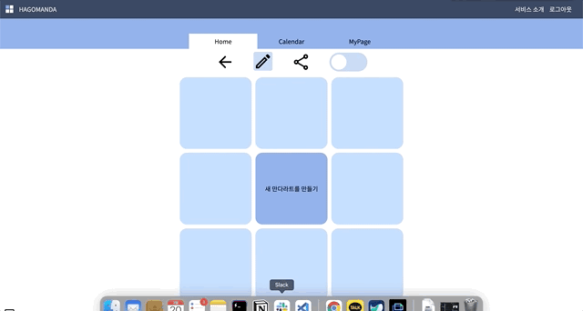

# HAGOMANDA

- [What is HAGOMANDA?](https://github.com/hagomanda/frontend#What-is-HAGOMANDA?)
- [Motivation](https://github.com/hagomanda/frontend#Motivation)
- [작업 기록](https://github.com/hagomanda/frontend#작업-기록)
- [Tech Stack](https://github.com/hagomanda/frontend#Tech-Stack)
- [기능 소개](https://github.com/hagomanda/frontend#기능-소개)
- [우당탕탕 개발 회고(Challenges)](https://github.com/hagomanda/frontend#우당탕탕-개발-회고(Challenges))
- [참여자들의 이야기](https://github.com/hagomanda/frontend#참여자들의-이야기)

## What is HAGOMANDA?

"혼자 계획 세우는 일은 너무 힘들어!"

'하고만다'는 만다라트의 '만다'와 꼭 하고 말겠다는 뜻의 '하고 만다'가 합쳐진 합성어로  
우리 팀, 우리 동아리, 우리 모임의 장기 목표 달성을 위해 함께 하는 플래닝 툴입니다.

[HAGOMANDA DEMO](https://hagomanda.kr/)  
[기능 설명 보러 가기](https://github.com/hagomanda/frontend#기능-소개)

  
우리 팀의 2022 만다라트

  

  

  

## Motivation

일정을 짜고 관리하는 도구는 차고 넘칩니다. 하지만 어떤 사람들은 좋은 도구를 가지고도 계획을 세우기도 전에 무력해지곤 합니다. 너무 큰 이상 앞에서는 무엇을 해야 할지 모르게 되곤 하거든요. 그 반대의 경우도 있습니다. 나름대로 열심히 달려왔다고 생각했는데 뒤돌아보니 엉뚱한 길로 온 지 오래였던 거죠.

HAGOMANDA가 차용한 만다라트(Mandalart) 계획표는 그런 경험이 있는 분들을 위한 플래닝 기법입니다. 혼자만의 계획이 아닌 함께 하는 모임이 있다면 더 좋죠. 우리 모임이 성장하면서 더 오래갈 수 있도록 핵심 목표 - 세부 목표 - 실천 리스트로 이어지는 계층화 된 계획표가 선택과 집중을 도와줍니다.

## 작업 기록

- [KANBAN](https://www.notion.so/584dc250d5894010b4dc0868e5e86f97)

  
1주차(기획) : 2022년 1월 24일 ~ 28일 (총 5일)

  

  - [아이디어 수집](https://www.notion.so/7427628cfb8646bf8a70f9b561c5e94b) 및 프로젝트 기획
  - [Mock up](https://www.notion.so/Mockup-fbfcdf771c6d47548d8538aeb0c4efae)
  - [DB Schema Modeling](https://www.notion.so/DB-schema-modeling-c0d254b5ed8e448595015b44fba1ec8e)
  - 기술 스택 검증
  - 태스크 카드 만들기
  - 협업 컨벤션(ESLint, Prettier, Husky, Commit & PR Template) 및 Git branch 전략 설정

  

  
2주차(개발) : 2022년 2월 5일 ~ 11일

  

  - Frontend
    - 기본 환경 셋업
    - firebase 로그인, 로그아웃 구현
    - 만다라트 기본 상세페이지 구현
    - 뷰모드, 뒤로가기, 공유하기 등 Toolbar 구현
    - 마이페이지 구현
  - Backend
    - 로그인, 로그아웃 및 인증 로직 구현
    - 기본 GET, POST API 작업 - 회원정보, 만다라트, 캘린더 Todo 추가 등
    - 추가 API 작업 - 공유하기, 삭제 기능 등
    - 스키마 작성

  

  
3주차(개발, 배포) : 2022년 2월 12일 ~ 18일

  

  - Frontend
    - 전체 디자인 개편 및 수정 작업
    - 캘린더 및 Todo 작업
    - 만다라트 및 Todo 삭제 기능 추가
    - Socket 관련 작업 - 동시 작업 및 저장, 채팅 기능 추가
    - 배포 및 테스트
    - 버그 픽스, 리팩토링
    - 테스트 코드 작성
  - Backend
    - Socket 세팅
    - 배포 및 테스트
    - 버그 픽스, 리팩토링
    - 테스트 코드 작성

  

## Tech Stack
- Client
  - `React`, `Redux-Saga`, `Redux Toolkit`, `Firebase`, `styled-components`
  - [Redux-Saga 적용기](https://github.com/hagomanda/frontend#든든한-조장-및-기술-리더-호찬)
- Server
  - `Node.js`, `Express`, `Mongo DB - Atlas, Mongoose`, `JWT`, `Socket.IO`
  - [Socket 버그 탐색기 1](https://github.com/hagomanda/frontend#든든한-조장-및-기술-리더-호찬)
  - [Socket 버그 탐색기 2](https://github.com/hagomanda/frontend#귀여움-및-애니메이션-담당-수진)
- Set up
  - `Prettier`, `husky`, `eslint`
  - [Husky 버전 이슈 극복기](https://github.com/hagomanda/frontend#버전과-문서의-중요성)
- Test
  - `mocha`, `chai`, `supertest`

## 기능 소개

  
핵심 목표 세우기 : 새 만다라트 생성

  

  - 로그인 후, Home 페이지에서 +마크를 통해 새 만다라트를 생성 할 수 있습니다.

  

  

  
세부 목표, 실천 리스트 만들기

  

  - 상단에 수정하기 아이콘을 통해 만다라트를 수정할 수 있습니다.
  - 각각의 서브 목표, 서브 목표에 따른 Todo를 작성할 수 있습니다.
  - 생성된 만다라트는 x 표시를 통해 삭제할 수 있습니다.

  

  

  
만다라트 보기 : HalfView, FullView

  

  - 작성한 만다라트는 언제든지 **부분(HalfView)**이나 **전체(FullView)**로 볼 수 있습니다.
  - 오른쪽 상단에 있는 버튼을 통해 만다라트의 모든 Todo를 한눈에 확인할 수 있습니다.
  - Full view mode에서 서브 목표 및 Todo 클릭 시, 해당 서브 목표 및 Todo 작성 칸으로 이동합니다.

  

  

  
실천 리스트 일정 등록하기

  

  - Todo를 원하는 주기에 따라 반복(매주, 매일)해서 Calendar에 추가하여 일정을 관리할 수 있습니다.
  - Calendar 페이지에서 해당 Todo의 완료 여부에 따라 check marking이 가능합니다.
  - Calendar에 추가된 Todo마다 세부적인 메모를 기록할 수도 있습니다.

  

  

  
공유하기

  

  - 공유하기 아이콘을 클릭하여 공동 작업을 할 사람의 이메일을 추가합니다.
  - 공유한 사람들과 실시간으로 채팅 및 공동 작업을 할 수 있습니다.

    
  

  

## 우당탕탕 개발 회고(Challenges)

### 협업은 처음이라..👀

  
경험이 없는 만큼 기본적인 것들을 꼭 지키자!

  

- 프로젝트를 진행하며 어려웠던 점 중 하나는 개발을 함께 한다는 점이었습니다. 세명 모두 팀으로 개발을 하는 것이 처음이어서 시작부터 끝까지 어떻게 해야할지 막막하였습니다. 기획 단계에서 이 어려움을 조원 모두가 공통적으로 갖고 있다는 것을 알게 되었고, 이를 통해 저희가 낸 결론은 “**경험이 없는 만큼 기본적인 것들을 꼭 지키자**” 라는 룰이었습니다.
- **시간 엄수, 의견은 협의 없이 혼자 결정하지 않기, 의사 전달 잘하기, 조금의 이슈라도 서로에게 즉각적으로 공유하고 소통하기, 코드리뷰 꼼꼼히 해주기** 등 당연한 것이지만 지켜지지않는다면 팀원간 협업에 큰 피해를 끼칠 수 있는 것들을  Ground Rule로 목록화하여 프로젝트를 진행하는 기간동안 잘 지켜나갈 수 있도록 하였습니다.

  

  
모두가 경험해보는 시간을 가지자

  

  - 일의 분배에 있어서는 모두가 함께 경험해보기로 하였습니다. 프로젝트의 기술 스택에는 세명 모두 처음 써보는 Redux Saga와 Socket.IO가 있었습니다. **시간 효율면에서 한 명이 하나의 기술 스택을 맡아 구현하는 것이 좋았겠지만, 셋 모두 기술스택을 공부하고 구현을 해보는 것이 모두가 새로운 것을 경험하고 개발자로서 성장 할 수 있다고 생각하였습니다.** 여러명이서 하나의 태스크를 나눠 개발하는 만큼, 깊이가 부족할 수 있어 서로 공부한 내용을 공유하는 시간을 갖기도 하였고 코드 리뷰를 할 때에 이해가 되지 부분은 꼭 서로 물어보고 이해를 할 수 있도록 노력하였습니다.
  - 같은 의미에서 칸반에 올라오는 카드에서 더 잘할 수 있는것과 별개로 가장 위에 올라와있는 카드를 선택해서 개발하였습니다. **그 결과 모두가 프로젝트의 전반적인 부분을 만질 수 있었고, 서로의 코드가 영향을 주게 되어 협업에서 스타일을 통일 시키는것의 중요성도 느낄 수 있었습니다.**

  

  
건강한 소통의 중요성

  

  - 서로 의견이 나뉘는 부분에서는 우선 서로의 주장을 모두 들어보기로 하였습니다. 의견 중 이해가 되지 않는 부분이 있다면 실제 코드나 예시를 통해 팀원 간의 이해와 존중을 최우선으로 하였고, 반대되는 의견이 있다면 그 이유와 다른 방안까지 설명하기로 하였습니다. 그 결과 작은 부분이라도 넘어가지 않고, 팀원끼리 이해를 바탕으로 건강한 소통을 할 수 있었습니다. 서로에 대한 존중을 통해 프로젝트를 더 나은 방향으로 만들어 나갈 수 있었고, **“내 생각이, 내 코드가 꼭 맞는 것은 아니구나"**라는 것을 모두가 느낄 수 있는 시간이었습니다.

  

### 버전과 문서의 중요성

  
문제는 버전!

  

  - 이번 프로젝트에서 Husky를 처음 도입했는데 제대로 실행되지 않았습니다. 유튜브 영상과 블로그 글을 통해 해결법을 모색했지만 해결되지 않았고, 에러 메시지로 검색하던 중 버전에 대한 이야기가 눈에 들어왔습니다. 4.x.x 버전을 쓰면 된다는 이야기였습니다.

  > 왜 4.x.x 버전은 되는 거지? 우리 버전은 7.x.x인데 뭐가 문제인 거지?

  - 4 버전으로 바꾸면 쉽게 해결될 것 같았지만, 원인을 모르고 해결하지 못하면 언제까지나 구 버전을 계속 찾아서 써야 한단 말이겠죠? 4 버전을 쓸 다른 이유가 있다면 모르겠지만 저희에겐 그럴 이유가 없었습니다.

  

  
가장 확실한 답은 공식 문서에 있다

  

  - 조금 더 찾다보니 5부터 사용 환경 세팅 방법이 바뀌었다는 글을 찾을 수 있었습니다. 다시 한 번 공식문서로 돌아가기로 했죠. 버전을 확인하고 공식 문서에서 소개하는 대로 차근차근 따라가며 설정하니 문제 없이 사용할 수 있었습니다. 검색이 쉬운 시대이다 보니 항상 나도 모르게 쉬운 길을 찾곤 합니다. 하지만 그 길이 옳다는 걸 누가 확언할 수 있을까요? 버전과 문서의 중요성을 다시 한 번 되새기는 계기였습니다.

  

## 참여자들의 이야기

### 든든한 조장 및 기술 리더 호찬

  
호찬의 업적 : Redux-Saga 적용기

  

  - 가장 신경 쓴 부분은 Saga입니다. 팀원 모두 Saga를 처음 써서 bolierplate를 정확히 어떻게 작성해야 할지, 언제 그리고 왜 이 기술을 써야 하는지 모르는 상태였습니다. 로그인과 로그아웃, 소켓 부분 등 Saga를 하나둘씩 써 보면서 조원 모두 이해도가 올라갔지만, 개발 막바지에 이르렀을 때 서버와의 통신 부분이 어떤 것은 Saga로 쓰이고 어떤 것은 컴포넌트 안에서 쓰이는 등 뒤죽박죽이었습니다. 일단 동작을 시켜보자는 생각으로 통신 방식을 통일 시키지 않은 것이 원인이었습니다. 관심사 분리를 위해 하루를 잡아 서버 통신 부분은 모두 Saga로 변경하였고, 조금 더 이해하기 좋은 코드를 만들 수 있어 뿌듯하였습니다.

  

  
Challenge: 배포 환경에서 Socket.IO에 문제가 생기다

  

  - 기술적으로, 심적으로 가장 어렵고 기억에 남는 것은 프로젝트 마지막날 새벽입니다. 로컬 환경에서 잘 작동해서 배포 후 아무 문제가 없을 줄 알았지만 오산이었습니다. 배포 환경에서 Socket.IO가 제대로 동작하지 않았습니다. 이대로라면 반쪽짜리 프로젝트가 될 것 같아 어떻게든 해결하기 위하여 소켓부분을 다시 처음부터 짜보기도 하고, cors문제인가 싶어 해당 부분도 다시 확인해 보았습니다. 하지만 여전히 동작하지 않았고, 공식 문서를 다시 확인해 보면서 적용하지 않은 option들을 적용해 보았습니다. Transport의 옵션값을 default가 아닌 websocket으로 바꿔주자 마침내 동작하기 시작했습니다. 밤을 새서 해결한 보람이 있었습니다.
  - 마감까지 몇 시간 남지 않은 상태에서 저는 한 번 더 도전하기로 하였습니다. 안전성 개선을 위해 로직을 Saga로 변경하는 것이었습니다. 하지만 이 방식도 배포 환경에서만 제대로 작동이 안 되었고, 시간 상 기존 방식으로 마무리하였습니다. 아쉬움이 남았지만 마지막에 큰 에러를 잡을 수 있어 가장 인상적이었습니다.

  

  
아쉬운 점 : 좀 더 사용자 친화적으로 만들 수는 없었을까?

  

  - 모든 것이 아쉽습니다. 좀 더 사용자 친화적으로 만들었으면 어땠을까. 동시 4명 접속까지 테스트를 해 봤는데 10명이 넘는 사람이 들어오면 어떻게 될 것인가. 달력 반복을 좀 더 세련되게 할 순 없었을까. 시간을 더 잘 쪼개서 프로젝트를 진행했으면 다 할 수 있지 않았을까 등의 아쉬움이 있습니다.
  - 특히 무언가에 막혔을 때, 깊게 생각하지 않고 빠른 해결 방법만 계속 검색하다 오히려 시간이 더 걸리기도 했습니다. 다음 프로젝트에서는 선택과 집중을 잘하고, 막히는 부분에서는 더 확실하게 생각하고 알아본 후 해결하여 시간을 아껴 아쉬움이 남지 않도록 할 예정입니다.

  

  
성장 포인트 : 협업, 팀으로 움직인다는 것

  

  - 처음으로 한 협업 프로젝트인 만큼, 협업하는 부분을 많이 배웠다고 생각됩니다. 기본적인 행동과 팀원 간 소통 뿐만 아니라, 코딩하는 측면에서도 협업 시 코드 스타일이나 에러 핸들링을 하는 방법, response 방식 등을 미리 정확히 확립해야 팀원이 하나의 유기체처럼 움직이지, 그렇지 않으면 오히려 효율이 떨어짐을 느꼈습니다. 이 다음 협업을 할 기회에서 이번 팀프로젝트 간 배운 것을 사용해 볼 것입니다.

  

### 귀여움 및 애니메이션 담당 수진

  
아쉬운 점 : 미처 다루지 못한 디테일한 작업들

  

  - 처음에 구현하고자 했던 기능을 다 구현하지 못한 점이 아쉬웠습니다. 소켓을 이용하여 메세지를 타이핑하고 있다는 모션 동작, 공유 유저 목록과 유저의 로그인/로그아웃을 on-off로 알려주는 부분, 프론트엔드 에러 핸들링을 더 세부적이게 못 다뤘던 부분이 가장 아쉬웠던 것 같습니다.
  - 하지만 이러한 아쉬웠던 점들을 통해 의사소통의 중요성, 프로젝트에 들어가기에 앞서 시간 배분을 어떻게 짜야 하는지, 개발에 있어 어느 부분에 좀 더 치중해야 할지, 클라이언트와 서버가 전체적으로 어떤 흐름으로 동작하는지에 대해 알 수 있었습니다. 아쉬웠던 부분을 다음 개인 프로젝트에서는 어떻게 보완할 수 있을지에 대해 미리 생각해볼 수 있는 시간이었습니다.

  

  
Challenge : 예측할 수 없었던 실서버 Socket 버그

  

  - 로컬에서는 코드가 생각한 대로 잘 동작했지만 실서버에서는 로컬 서버와 다르게 동작을 했던 부분과 소켓 연결 부분에서 어려움을 겪었습니다. 구현하고자 했던 기능은 여러 사람과 동시에 작업을 하고 채팅을 하는 기능인데 소켓이 생각처럼 모든 사람과 연결되지 않고, 2:2로 연결이 되거나 몇 명은 제대로 연결이 되지 않는 문제가 있었습니다. 이러한 문제를 통해 내가 작성한 코드 외에도 팀원들의 코드를 좀 더 한 자 한 자 이해하려고 노력하였고, 코드를 작성할 때 현재 작성한 코드보다 더 좋은 방향은 없는지 생각해 보며 리팩토링하는 시간을 가져볼 수 있었습니다. 또, 내가 작성한 코드 외에 방대하게 늘어나는 팀원 분들의 코드를 읽고 이해하는 부분에서도 어려움이 있었지만, 코드에 대한 즉각적인 피드백과 이슈를 공유하면서 했던 브레인스토밍, 각자 문제 해결을 했을 때마다 아낌없이 주는 격려 등을 통해 프로젝트를 진행하면서 마주친 수많은 어려움을 팀원분들이 있어 헤쳐나갈 수 있었다고 생각합니다.

  

  
성장 포인트 : 함께 연구하며 문제 해결하기

  

  - 기술적인 부분에 있어서 성장한 점도 많지만, 가장 성장했다고 느낀 점은 의사소통과 협업을 하는 방법이라고 생각합니다. 이번 팀 프로젝트를 통해 혼자 정리하지 못했던 개념을 같이 공유하며 배울 수 있었습니다. 무엇보다 성급하게 접근하고 해결하려는 습관이 있어 잔 실수가 많았는데 팀원들을 통해 차근차근 해결해 나가는 과정과 새로운 기술을 단계적으로 접근하는 방법, 팀원 간의 의사소통을 하는 방법, 내 의견을 어떻게 말하고 전달해야 하는지에 대해 많이 배우고 성장할 수 있는 시간이었습니다.

  

### 게으름 및 워라밸 담당 서지

  
서지의 업적 : 아토믹 디자인과 UI 수정하기

  

  - FullView UI 버그 수정 건이 기억에 남습니다. 세부적인 부분과 CSS를 수정해야 했는데, 좀처럼 해결되지 않아 하루 동안 거듭 고민했던 태스크였습니다.
  - 이번 프로젝트에서 처음으로 아토믹 디자인 개념을 접해, 일부 컴포넌트는 그에 따라 작업했습니다. 작은 박스 컴포넌트가 9개 모여서 HalfView를, 그리고 81개 모여서 FullView를 구성하도록 기획 및 구현하였는데, 박스 컴포넌트 가변 사이즈가 원하는 대로 통제되지 않았습니다. 아토믹 디자인에 익숙하지 않다 보니 발생한 버그였던 것 같습니다.
  - 버그 수정을 하려면 오히려 관계된 다른 컴포넌트를 고려해야 하는 복잡한 상황이었습니다. 처음으로 돌아가 가장 작은 단위의 컴포넌트부터 독립적으로 형태와 비율, 그리고 기능을 유지할 수 있도록 점검하여 버그를 수정했습니다. 당시에는 참 막막하고 아찔했던 순간이었지만 돌이켜보니 아토믹 디자인에 대해서 다시 한 번 생각해볼 기회가 되었던 것 같습니다.

  

  
아쉬웠던 점 : 수박 겉핥기 식 기술 검증

  

  - 핵심 기술 검증을 좀 더 열심히 했으면 좋았을 거라는 생각이 작업 기간 내내 들곤 했습니다.
  - 프로젝트를 기획하는 1주차, 핵심 기술 두 가지 Redux-Saga와 Socket.IO에 대해 각자 공부하는 시간을 가졌습니다. 딴에는 개념 중심으로 열심히 공부했다고 생각했는데 막상 2주차, 3주차에 실전 적용을 하려 하니 마음처럼 쉽게 되지 않았습니다. 작업이 더디게 진행되었고, 다른 팀원들이 먼저 작성하여 올린 코드 리딩 및 리뷰에도 많은 시간이 걸릴 수밖에 없었습니다.
  - 기술 검증이라는 것이 단순히 그 기술의 개념을 공부하는 데 그쳐서는 안 되는 일이었습니다. 해당 기술을 이용해서 작은 기능이나 애플리케이션이라도 한 번 만들어보고, 프로젝트에서 어디에 해당 기술이 필요할지, 어떤 형태로 필요할지 미리 예상도 해보고 데모를 거쳐보는 것까지가 기술 검증이라고 할 수 있었습니다. 개인 프로젝트에서는 이런 실수를 하지 않도록 기획 단계에서 더 노력하기로 마음 먹었습니다.

  

  
성장 포인트 : 협업과 새로운 기술

  

  - 역시 협업을 경험해볼 수 있었던 점이 가장 큰 성장 포인트라고 생각합니다. 어떤 형태로든 내가 작업한 결과물이 다른 사람의 작업에 영향을 미치니, 작업 시간 엄수는 물론 코드에 조금 더 신경을 쓸 수밖에 없었습니다. 반대로 제가 작업을 할 때도 다른 사람의 결과물을 리딩하고 작업해야 하는 경우가 종종 있었기 때문에, 제대로 이해하려면 커뮤니케이션이 필수적이었습니다. 개인 프로젝트에서는 절대 경험할 수 없었겠죠.
  - 프로젝트에 Redux-Saga를 도입한 부분도 경험치를 올려준 것 같습니다. 평소에는 쓸 일이 없던 Generator 함수를 통해, 비동기 작업 흐름을 체계적이고 강력하게 통제할 수 있었습니다. 한편으로는 작성해야 하는 보일러 플레이트 및 코드의 양이 많아, 진행할 프로젝트의 규모가 작다면 다른 기술 채택을 고려해보는 것도 한 가지 방법이 아닐까 고민하게 만들기도 했습니다. 만약 개인 프로젝트 때 비동기 작업이 들어가게 된다면 더욱 간단하게 사용할 수 있는 React Query를 채택할 것 같네요!

  

## Contact

- 이호찬 lhc0506@gmail.com / [https://github.com/lhc0506](https://github.com/lhc0506)
- 강서지 lazymoledg@gmail.com / [https://github.com/lazymole](https://github.com/lazymole)
- 전수진 junsuejin98@gmail.com / [https://github.com/soozynn](https://github.com/soozynn)
